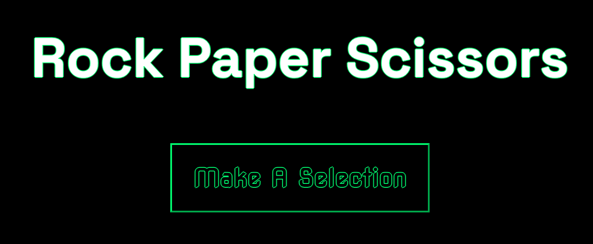

# Rock 🪨 Paper 📄 Scissors ✂️

A fresh interface for an old game: play against a computer by selecting rock, paper, scissors, or letting the computer decide. In this version, there is a secret weapon you can use if you know the secret password!

<!-- ## 🚀Live Demo
[Click here to try it out!](ADD LINK) -->

## 🎥 Preview

## 🛠️ Built With
HTML, CSS, JavaScript (Vanilla JS, no frameworks)
Hosted on GitHub Pages

## 🔧 How to Run Locally
1. Clone the repo:
git clone https://github.com/jess-isaacs/RPS-game.git
